# Animasyon Stil Kataloğu

[irticalen](https://irticalen.yasinozmeen.me) videoları için denenmiş **20 animasyon tarzı**. Her tarz, o tarzı en iyi gösteren 9–10 saniyelik kendi kısa filmiyle burada.
Yeni bir animasyon yaptırmadan önce bu sayfaya bak, tarzı seç, adını söyle: *"şu konuyu `blueprint` tarzında anlat"*.

▶️ **Hepsi tek videoda:** [`katalog/katalog.mp4`](katalog/katalog.mp4) (3:46, 720p)

## Hızlı seçim

| # | Tarz | Nasıl bir his | En iyi ne için |
|---|---|---|---|
| 01 | [Kurzgesagt](#01--kurzgesagt) | Parlak, derinlikli, bilim belgeseli | Bilimsel bir fikri merak uyandırarak anlatmak |
| 02 | [İzometrik](#02--i̇zometrik) | Minyatür maket dünya | Bir sistemin/sürecin parçalarını göstermek |
| 03 | [Bauhaus](#03--bauhaus) | Afiş, ızgara, temel şekiller | Adımlar, ilkeler, net ve cesur mesaj |
| 04 | [Memphis](#04--memphis) | 80'ler, oyuncu, zıplayan | Eğlenceli duyurular, Shorts, oyun hissi |
| 05 | [Beyaz tahta](#05--beyaz-tahta) | Çizilirken anlatılan ders | Adım adım açıklama, "nasıl çalışır" |
| 06 | [Kara tahta](#06--kara-tahta) | Tebeşirli sınıf dersi | Ders, kural, "bunu unutma" anları |
| 07 | [Blueprint](#07--blueprint) | Mühendis teknik çizimi | Ölçü, teknik detay, nesnenin içi |
| 08 | [Tek çizgi](#08--tek-çizgi) | Kopmayan tek çizgi, minimal | Şık açılış/kapanış, bir fikirden ötekine geçiş |
| 09 | [Kâğıt kesik](#09--kâğıt-kesik) | Katmanlı karton diorama, masalsı | Hikâye anlatımı, duygusal girişler |
| 10 | [Karakalem](#10--karakalem) | Eskiz defteri, grafit | Fikir üretme süreci, tasarım/düşünce anlatımı |
| 11 | [Linocut](#11--linocut) | Oyma baskı, siyah + kırmızı | Güçlü tek mesaj, manifesto, afiş |
| 12 | [Kil](#12--kil) | Hamur stop-motion, sıcak | Samimi, çocuksu, sevimli anlatım |
| 13 | [70'ler](#13--70ler) | Tüplü TV şovu jeneriği | Nostaljik açılış, seri jeneriği |
| 14 | [Piksel sanat](#14--piksel-sanat) | 16-bit platform oyunu | Oyunlaştırma, ilerleme, "bölüm geçtin" |
| 15 | [16 mm belgesel](#15--16-mm-belgesel) | Siyah-beyaz eski film | Tarih, köken hikâyesi, ciddi ton |
| 16 | [Çizgi roman](#16--çizgi-roman) | Gazete çizgi romanı, paneller | Komik anlar, diyalog, gerilim-çözülme |
| 17 | [Terminal](#17--terminal) | Yeşil fosforlu komut satırı | Teknik/AI süreci, "arka planda ne oluyor" |
| 18 | [Bilim-kurgu arayüzü](#18--bilim-kurgu-arayüzü) | Soğuk HUD, radar, analiz | Ölçüm, analiz, puanlama anlatımı |
| 19 | [Veri görselleştirme](#19--veri-görselleştirme) | Editoryal grafik, haber sitesi | Sayılarla kanıt, önce-sonra karşılaştırma |
| 20 | [Kinetik tipografi](#20--kinetik-tipografi) | Sadece kelimeler, ritim | Alıntı, güçlü cümle, Shorts kancası |

Daha önce aynı hikâyeyle (telefonla ses kaydı açıklaması) denenmiş tarzlar: sade düz illüstrasyon, **Vox** (kolaj + fosforlu kalem), **suluboya**, **cyberpunk**. Bunlar bu depoda değil; istenirse eklenir.

---

## Düz grafik

### 01 · Kurzgesagt
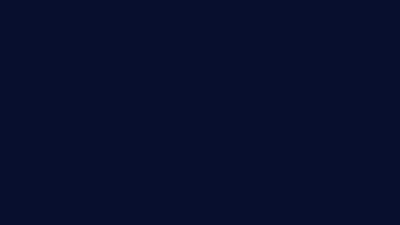

Uzayda sesin yayılmadığını anlatıyor: balon uydunun ses halkaları boşlukta sönüyor, kamera gezegene dalıyor, havada molekül dalgası geçiyor, sayaç "343 metre".
**İmza:** yuvarlak geometri, doygun lacivert-mor, ışık yönünde parlak kenar + gölge hilali, atmosfer parıltısı, zoom geçişi. · [video](stiller/kurzgesagt/kurzgesagt.mp4)

### 02 · İzometrik
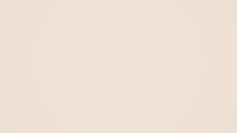

Bir konuşma stüdyosu parça parça kuruluyor; kamera geri çekilince çevresine sekiz mini konu dünyası düşüyor: "Her konu, küçük bir dünya."
**İmza:** 30° maket, düşüp ezilerek oturan parçalar, yüzey açısına göre eğik yazılar, izometrik ızgara. · [video](stiller/izometrik/izometrik.mp4)

### 03 · Bauhaus
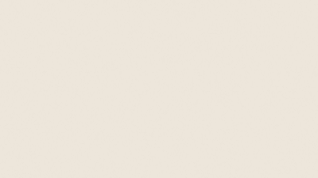

"DOĞAÇLA." afişi kuruluyor; daire, kare, üçgen üç adımı temsil ediyor (düşün, kur, konuş), sonra 60 saniyelik saat adım adım iniyor.
**İmza:** görünür 12 sütun ızgara, ana renkler + siyah, büyük grotesk harfler, mekanik hareket. · [video](stiller/bauhaus/bauhaus.mp4)

### 04 · Memphis
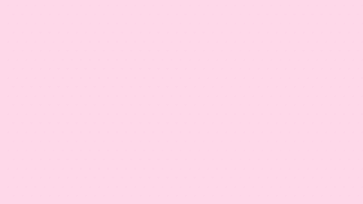

Konu çarkı dönüp MÜZİK'te duruyor, konfeti; "Konu: MÜZİK", 60 saniye rozeti, zıplayan "KONUŞ!".
**İmza:** zikzak, nokta, dalga desenleri, pastel + neon, kalın kontur ve sert gölge, ezilip uzayan zıplamalar. · [video](stiller/memphis/memphis.mp4)

## El çizimi

### 05 · Beyaz tahta
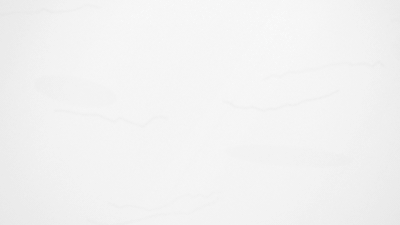

"Doğaçlama nasıl işler?" — fikir → 60 sn → konuş! zinciri çiziliyor, ok ikinci bölüme taşıyor: "Aklına geleni söyle."
**İmza:** çizgi yolu boyunca açılan çizim, siyah keçeli + tek kırmızı, tahta yansıması, eski kalem izleri. · [video](stiller/beyaz-tahta/beyaz-tahta.mp4)

### 06 · Kara tahta
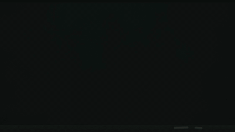

"Ders 1 · Doğaçlama": dinle → düşün → konuş yazılıyor, silgi "düşün"ü siliyor, en altta "Düşünme, konuş!"
**İmza:** taneli tebeşir dokusu, silinme bulaşığı ve hayalet yazı, tebeşir tozu, ahşap tebeşirlik. · [video](stiller/kara-tahta/kara-tahta.mp4)

### 07 · Blueprint
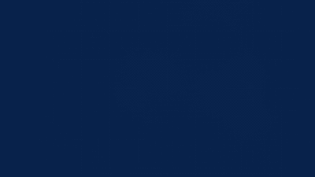

Bir stüdyo mikrofonunun teknik resmi: önden görünüş, A–A kesiti, üstten görünüş, cm ölçüleri, sonunda antet doluyor.
**İmza:** cyanotype mavi kâğıt, beyaz ince çizgi, ölçü okları, kesit taraması, izdüşüm çizgileri, teknik antet. · [video](stiller/blueprint/blueprint.mp4)

### 08 · Tek çizgi
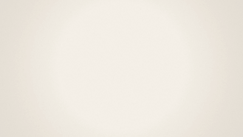

Tek bir mürekkep çizgisi kopmadan konuşma balonu → mikrofon → el yazısıyla "merhaba" oluyor: "bir çizgi, bir söz."
**İmza:** hiç kopmayan çizgi, baskıyla değişen kalınlık, krem kâğıt, tek kırmızı kalem noktası. · [video](stiller/tek-cizgi/tek-cizgi.mp4)

## Doku ve zanaat

### 09 · Kâğıt kesik
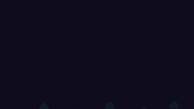

Gece bir karton diorama kuruluyor: "Bir varmış, bir yokmuş…"; gece kartonu çekilince şafak: "Şimdi sıra sende."
**İmza:** 5 derinlik katmanı ve gölgeleri, kesik kenar ışığı, iplikte sallanan yıldızlar, ışık yönü değişince dönen gölgeler. · [video](stiller/kagit-kesik/kagit-kesik.mp4)

### 10 · Karakalem
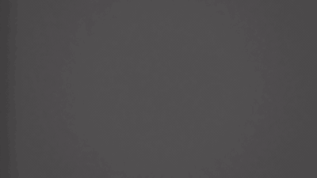

Eskiz defterinde bir mikrofon aşama aşama çiziliyor, yanına "önce konuş, sonra düşün." notu; sayfa çevriliyor.
**İmza:** silinmemiş yardımcı çizgiler, çapraz tarama, dağıtılmış grafit tonu, titreyen çizgi, kıvrılan sayfa. · [video](stiller/karakalem/karakalem.mp4)

### 11 · Linocut
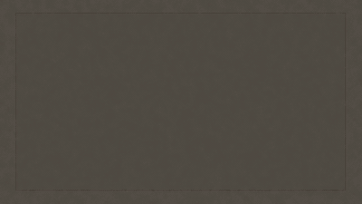

Güneş ışınları ve sayaç halkası damga gibi basılıyor, 3·2·1, merdane geçiyor, kırmızı balon: "SÖZ SENDE!"
**İmza:** yalnız siyah + kırmızı, oyma olukları, kıymıklar, baskı kayması, mürekkep eksikliği, 12 fps basamaklı hareket. · [video](stiller/linocut/linocut.mp4)

### 12 · Kil
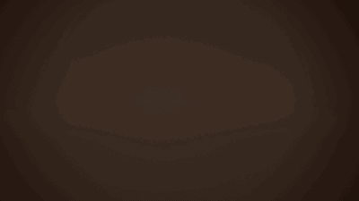

Hamur top düşüp ezilerek konuşma balonuna dönüşüyor, harfler zıplıyor: "Hadi konuş!"; sonra logo hamurdan kuruluyor.
**İmza:** 12 fps stop-motion, ezilip uzama, parmak izi dokusu, yarı mat parlama, sıcak ışık. · [video](stiller/kil/kil.mp4)

## Nostalji

### 13 · 70'ler
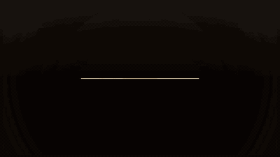

TV şovu jeneriği: tüplü TV açılıyor, çizgili güneş, gökkuşağı şerit, konu çarkı "Hayaller"de duruyor, TV kapanıyor.
**İmza:** turuncu/kahve/hardal, yuvarlak kalın yazı, üç katlı gölge, tarama çizgisi, gren, renk kayması. · [video](stiller/retro-70ler/retro-70ler.mp4)

### 14 · Piksel sanat
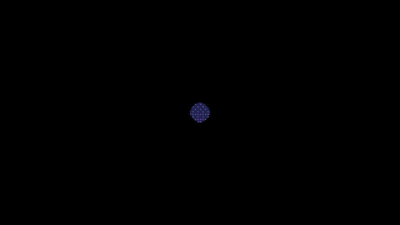

16-bit platform oyunu: mikrofon karakteri Miko S-Ö-Z harflerini topluyor, uykulu "Susku"yu eziyor: "KELİME TAMAM!"
**İmza:** 320×180'den keskin büyütme, 18 renk, katmanlı kayan arka plan, sprite kareleri, oyun göstergesi, Türkçe harfli özel piksel font. · [video](stiller/piksel/piksel.mp4)

### 15 · 16 mm belgesel
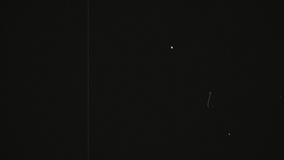

Film başı geri sayımı, "Sözün İzinde" yazı kartı, ışık huzmesinde eski şerit mikrofon, "Her söz, bir cesaretle başlar."
**İmza:** siyah-beyaz, çizik ve toz, pozlama titremesi, kenar kararması, süslü serif kartlar, projektör sesi. · [video](stiller/belgesel-16mm/belgesel-16mm.mp4)

### 16 · Çizgi roman
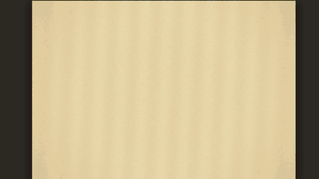

Paneller arasında gezen kamera: ter döken mikrofon "SIRA SENDE!", TIK! TAK!, "POP!", "MERHABA! BEN HAZIRIM."
**İmza:** Ben-Day nokta baskı, renk kalıbı kayması, sararmış gazete, kalın mürekkep, balonlar ve ses efekti yazıları. · [video](stiller/cizgi-roman/cizgi-roman.mp4)

## Teknik ve deneysel

### 17 · Terminal
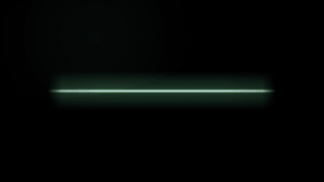

CRT açılıyor, `irticalen --konu rastgele --süre 60`, konu "Bir şehri kokusuyla anlat"ta kilitleniyor, ASCII 3-2-1, canlı yazıya dökme.
**İmza:** yeşil fosfor ve iz, tarama çizgisi, imleç, ASCII rakamlar, kutu çizgileri, çizgiye inen kapanış. · [video](stiller/terminal/terminal.mp4)

### 18 · Bilim-kurgu arayüzü
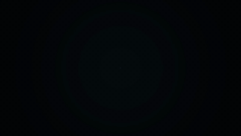

Radar bir konuşmayı analiz ediyor: hız, duraksama, dolgu sözcüğü ("şey", "yani"); sonuç "AKICILIK 87/100".
**İmza:** ince dönen halkalar, derece ölçeği, kodu çözülerek beliren etiketler, tek soğuk renk, parlama yok. · [video](stiller/hud/hud.mp4)

### 19 · Veri görselleştirme
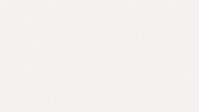

"Konuştukça 'şey' azalıyor": çizgi grafik kendini çiziyor, fark "−%78", sonra çubuk grafik (temsili veri).
**İmza:** editoryal başlık düzeni, çizgi üstü etiketler, sayan rakamlar, tek vurgu rengi, kaydırmalı anlatım. · [video](stiller/veri/veri.mp4)

### 20 · Kinetik tipografi
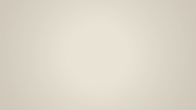

"Önce susarsın. Sonra bir kelime gelir. … konuşuyorsun." — sessizlik ince ve küçük, konuşma kalın ve büyük.
**İmza:** yalnız kelimeler; ölçek, kalınlık ve ritimle anlam; canlı değişen yazı kalınlığı, kayan satırlar. · [video](stiller/kinetik-tipografi/kinetik-tipografi.mp4)

---

## Nasıl üretildi

Her tarz, [Claude](https://claude.com/claude-code) (Opus 5.5) tarafından kısa bir brief'ten ([`BRIEF.md`](BRIEF.md)) tasarlandı ve kodlandı. Hareketin nasıl yapılacağı tarif edilmedi; yalnız amaç, tarz ve teknik sınırlar verildi.

- Her klip bir `anim.html`: 1920×1080 canvas, `window.draw({t})` o anın karesini döndürür.
- Kareler Playwright'ın başsız Chromium'u ile çizilir (`render.mjs`), ffmpeg ile videoya çevrilir. Sesler (varsa) ffmpeg/Python ile sentezlenir, hazır ses dosyası yok.
- Yeniden üretmek için: Node + `@playwright/test` (global) + Chromium headless shell + ffmpeg. Klasördeki `build.sh` / `yap.sh` (yoksa `render.mjs`) çalıştırılır. `birlestir.sh` kataloğu yeniden birleştirir.

Yazı tipleri Google Fonts'tan (SIL Open Font License); her klasörün `fonts/` dizininde.
